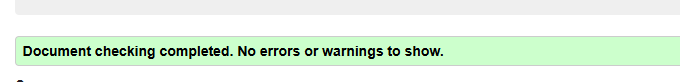
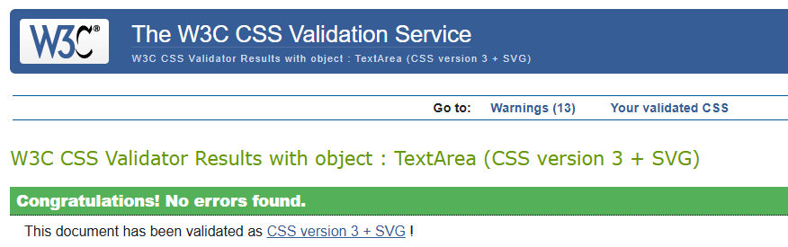
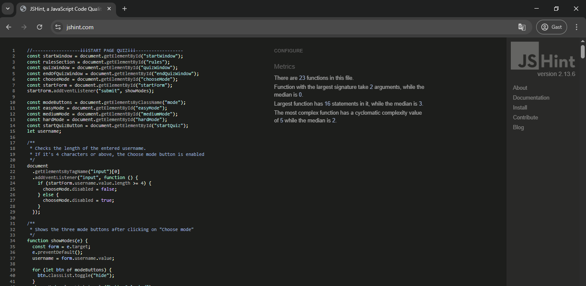
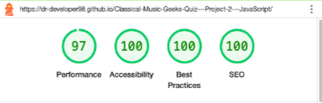
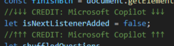
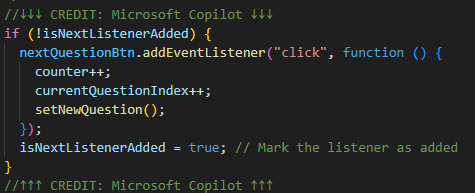
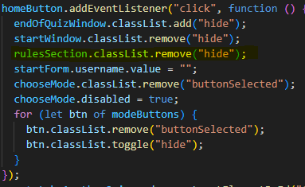
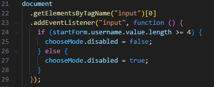
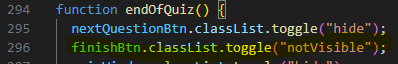

<h1>TESTING</h1>

<!--I tested that this website works across some of the major Browsers: Google Chrome, Mozilla Firefox and Microsoft Edge. I also ran manual tests on the following devices and the website worked on all of them as expected.

Mobile phones: Samsung A52, Iphone 7 Plus;
Tablet: Galaxy Tab A (2016)
Laptop: Lenovo
For responsiveness and tests on devices larger than the ones mentioned above I used the BrowserDev Tools.-->

<h2 style="color: darkorange">Validator testing</h2>
<h3>HTML</h3>

<h3>CSS</h3>

<h3>JavaScript</h3>

<h2 style="color: darkorange">Lighthouse report</h2>
<h3>Lighthouse score</h3>

<h2 style="color: darkorange">Manual testing</h2>

<table>
<tr>
<th>Action</th>
<th>Expected behaviour</th>
<th>Pass/Fail</th>
<tr>
<tr>
<td>START PAGE</td>
<td>-</td>
<td>-</td>
</tr>
<tr>
<td>Click on URL</td>
<td></td>
<td></td>
</tr>
<tr>
<td>Type a username of less than 4 characters in the input field</td>
<td>Choose Mode button remains disabled</td>
<td>Pass</td>
</tr>
<tr>
<td>Type a username of 4 characters or more in the input field</td>
<td>Choose Mode button is enabled</td>
<td>Pass</td>
</tr>
<tr>
<td>Click on Choose mode button</td>
<td>Choose Mode button background turns brown and text turns white; three mode buttons + disabled Start the quiz! button appear under it </td>
<td>Pass</td>
</tr>
<tr>
<td>Click on any of the mode buttons</td>
<td>The selected button background turns brown and text turns white + Start the quiz! button is enabled</td>
<td>Pass</td>
</tr>
<tr>
<td>When a mode is already selected, click on another mode button</td>
<td>The previously selected button background turns white and its text turns brown again; newly selected button background turns brown and its text turns white. Start the quiz! button keeps being clickable"</td>
<td>Pass</td>
</tr>
<tr>
<td>Hover over any of the buttons when they're not selected</td>
<td>Background colour changes to brown, text colour turns white as long as long as the mouse cursor finds itself inside the button</td>
<td>Pass</td>
</tr>
<tr>
<td>Hover over a button that is already displayed as "selected"</td>
<td>No changes in background- or text-colour take place</td>
<td>Pass</td>
</tr>
<tr>
<td>Click on "Start the quiz!" button after selecting "Easy (5 questions)"</td>
<td>Quiz window appears, displaying a question counter of 1/5 and the following elements:
<ul>
<li>upper left corner: the entered username;</li>
<li>under the question counter: the question text;</li> 
<li>under the question text: four buttons, each of them displaying one of the four possible answers</li>
<li>bottom right corner: the disabled "Next question" button</li>
</ul>
</td>
<td>Pass</td>
<tr>
<td>Click on "Start the quiz!" button after selecting "Medium (7 questions)"</td>
<td>Quiz window appears, displaying a question counter of 1/7 and the following elements:
<ul>
<li>upper left corner: the entered username;</li>
<li>under the question counter: the question text;</li> 
<li>under the question text: four buttons, each of them displaying one of the four possible answers</li>
<li>bottom right corner: the disabled "Next question" button</li>
</ul>
</td>
<td>Pass</td>
</tr>
</tr>
<tr>
<td>Click on "Start the quiz!" button after selecting "Hard (10 questions)"</td>
<td>Quiz window appears, displaying a question counter of 1/10 and the following elements:
<ul>
<li>upper left corner: the entered username;</li>
<li>under the question counter: the question text;</li> 
<li>under the question text: four buttons, each of them displaying one of the four possible answers</li>
<li>bottom right corner: the disabled "Next question" button</li>
</ul>
</td>
<td>Pass</td>
</tr>
<tr>
<td>QUIZ SECTIONS (applicable to all modes)</td>
<td>-</td>
<td>-</td>
</tr>
<tr>
<td>Hover over any of the answer buttons or the "Next question" button</td>
<td>Hovered over button background-colour turns brown and text-colour turns white, as long as cursor finds itself inside the button</td>
<td>Pass</td>
</tr>
<tr>
<td>Click on "Next question" button before selecting an answer</td>
<td>Quiz doesn't go on to the following question</td>
<td>Pass</td>
</tr>
<tr>
<td>Select correct answer</td>
<td>Selected button background-colour turns green, text-colour turns white. If the mouse cursor is inside button, its background-colur will be brown and the border will be green. "Next question" button is now clickable</td>
<td>Pass</td>
</tr>
<tr>
<td>Select wrong answer</td>
<td>Selected button background-colour turns red, text-colour turns white; the correct answer button turns green, its text-colour turns white. If the mouse cursor is inside button, its background-colur will be brown and the border will be red. "Next question" button is now clickable</td>
<td>Pass</td>
</tr>
<tr>
<td>Click on "Next question" button after having answered 1st question</td>
<td>New question and its answers appear. Question counter is increased to 2/n, where "n" is the maximum number of questions per mode. Username keeps being displayed in the upper left corner; "Next question" button shows in the bottom right cornern and is disabled.</td>
<td>Pass</td>
</tr>
<tr>
<td>Click on "Next question" button after having answered 2nd, 3rd, .... n-1 question</td>
<td>New question and its answers appear. If "p" is the previous question index, the question counter is increased to (p+1)/n. Username keeps being displayed in the upper left corner; "Next question" button shows in the bottom right cornern and is disabled.</td>
<td>Pass</td>
</tr>
<tr>
<td>Answer the (n-1)/n question</td>
<td>New question and its answers appear. The question counter has now reached n/n. The username is still displayed in the upper left corner. The "Next question" button is no longer visible.</td>
<td>Pass</td>
</tr>
<tr>
<td>Answer the n/n question</td>
<td>Selected button turns either red or green depending on correctness. In case of a wrong answer, the correct answer turns green. After 500ms from selecting an answer, the "Finish" button appears - clickable - in the place of the "Next question button"</td>
<td>Pass</td>
</tr>
<tr>
<td>Click on "Finish" button</td>
<td>New window appears, displaying the following:
<ul>
<li>At the top: the subheading "You've reached the end of the quiz!";</li>
<li>In the middle, under the subheading: "Your score: (X correct answers)/n" and below this a paragraph showing either "Well done on this, {username}!" (if 60% of given answers are correct) or "Looks like this was a little bit tricky, {username}!
Don't worry, though! You've probably learnt something new :)"</li>
<li>At the bottom: the home button and the "Take another quiz!" button.</li>
</ul>
</td>
<td>Pass</td>
</tr>
<tr>
<td>END OF QUIZ WINDOW</td>
<td>-</td>
<td>-</td>
</tr>
<tr>
<td>Click on the Home button</td>
<td>Brings user back to the start page without rerendering the website; the input field for the username is empty, the "Choose mode" button isn't selected, therefore the mode buttons and the "Start the quiz" button aren't visible</td>
<td>Pass</td>
</tr>
<tr>
<td>Click on the "Take another quiz!" button</td>
<td>Displays a screen containing only the following:
<ul>
<li>At the top: the username input field, with the previously entered username still showing inside of it;</li>
<li>Under the input field: the "Choose mode" button appearing selected;</li>
<li>Under the selected "Choose mode" button: the three mode buttons + disabled "Start the quiz" button</li>
</ul>
</td>
<td>Pass</td>
</tr>
<tr>
<td>TAKE ANOTHER QUIZ SCREEN</td>
<td>-</td>
<td>-</td>
</tr>
<tr>
<td>Click on any of the modes</td>
<td>"Start the quiz" button is now clickable</td>
<td>Pass</td>
</tr>
<tr>
<td>Click on "Start the quiz" after selecting a mode</td>
<td>Quiz starts displaying the elements described above, with the maximum number of questions depending on the mode</td>
<td>Pass</td>
</tr>

</table>

<h2 style="color: darkorange">Fixed Bugs</h2>
<ul>
<li>When taking the quiz a 2nd time, the question counter would increment by 2 instead of just 1, which meant that you would even see question 11/10, 13/10 in the hard mode, since the counter would never equal the maximum number of question (as it is an even number, in this case). This was fixed by adding a variable to check whether the click event listener on the "Next question" button was already assigned. If it was, then it wouldn't be added again, therefore the "counter++" would cease to be triggered. <strong>Credit/Source:</strong> "Microsoft Copilot"</li>
 

<li>When taking the quiz a 2nd (3rd, 4th or nth) time by clicking on the "Take another quiz!" button, once having completed the quiz, if you went back on the Start page via the "Home" button, the rules section wouldn't appear. This was caused by the fact that the rulesSection still having the class "hide" active (this was caused by the function in the click event listener for the "Take another quiz button"). This was fixed by adding the following line of code to the homeButton event listener function:</li>
 

 
<li>The if statement that was supposed to check for the length of the entered username to be at least 4 characters wasn't working, which caused the "Choose mode" button to stay disabled. This was fixed by assigning the input field an event listener, listening for text input and a function which includes the if statement:</li>
 

 
<li>In the earlier stages of the development process, the "Finish" button at the end of the quiz had the label "Next". The event listener that calls the function endOfQuiz wasn't working, which caused the appearance of the "Next question" button next to the "Finish" button. This was simply fixed by adjusting the name of the button in the endOfQuiz function in the line of code that toggles the "notVisible" class.</li>
 

</ul>